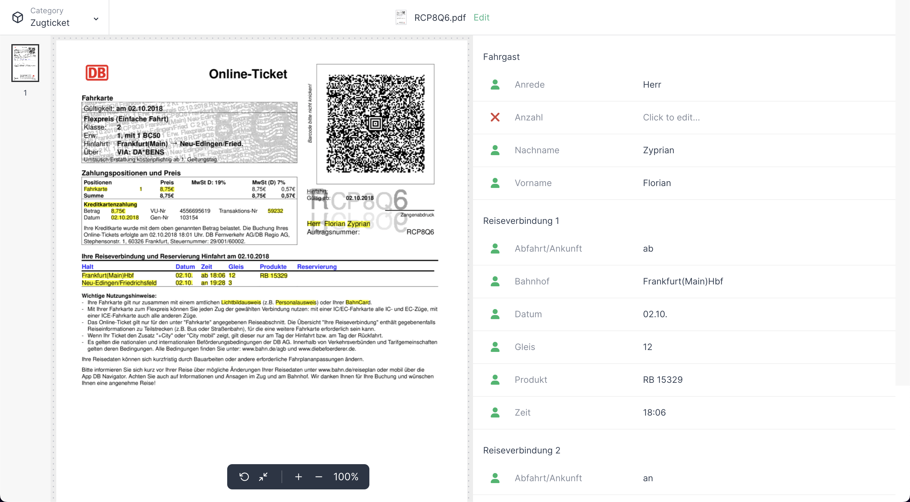

# konfuzio-capture-vue

(Under active development)

White Label widget, that let's you upload your documents to Konfuzio and preview the results. Chrome, Firefox, Edge and Safari supported.

# **Requirements**

Software Required:

- node
- npm

# **Installation**

Follow the steps below to get the app running.

1. Clone Repository
2. Run `npm install` in the project root.
3. Create a `.env` file in the project root with the properties from the `.env.example` file.
4. Run `npm run serve` to serve a local development app to run on a browser (default localhost:3000).
5. Run `npm run build` to build the app for production and then export the `dist` folder to a web server.

# **Documentation**

This sample app is built around Vue.JS and all the required components are inside the `app` folder.

## Vue Components

The entry point of the app is the `index.js` where the `DashboardData.vue` component is loaded. Basically it has the responsiblity to tell the store to fetch API data and save it on a local store.
The other component loaded is the `DashboardDocument.vue` and is where the app starts to be drawn. It's the main container of the document thumbnail list (`DocumentPages.vue`), the Document itself (`PDFPage.vue`) and the sidebar for the labels information (`LabelSets.vue`).

### DocumentPages

This is a simple component to just load the document images and display them in a vertical list to act as a thumbnail selector. Is fully clickable and updates it state automatically.

### PDFPage

This component is responsible for drawing the document and handling any interaction with it like scrolling (`ScrollingDocument.vue`) and render a loading dummy page (`DummyPage.vue`). It also draws the bounding boxes for the existing annotations.

### LabelSets

This component is responsible for creating a tab bar component to interact with each label set on the project. For each label set selected, a list of labels and annotations are shown alongside with their information (`Labels.vue`).

## Store

The store is implemented using `Vuex` and is located under `store/index.js`. Is responsible for the behaviour of the app, is where most of the information is obtained, filtered, grouped and processed and is divided in concepts like, for example, document and sidebar.

## Styles

There is a `styles.scss` file in the `styles` folder that contains all the styles needed for the app. You can customise it by changing the `:root` class in the top of the file to match the theme you want.
